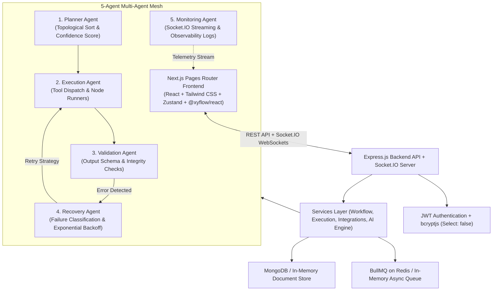

# Agentflow_AI — Agentic AI Operations Automation Platform

**Agentflow_AI** is a full-stack, enterprise-grade AI Operations Automation platform that converts natural language automation requests into executable Directed Acyclic Graph (DAG) visual workflows. Workflows are rendered on an interactive drag-and-drop canvas and executed through a cooperating chain of specialized AI agents with self-healing error recovery, encrypted OAuth third-party integrations, background queues, and live WebSocket telemetry.

---

## Architecture & System Overview



---

## Key Features

- 🧠 **AI Prompt-to-Workflow Generator**: Input plain English automation requests and watch visual workflows materialize instantly. Multi-tier LLM routing prefers **OpenRouter** (`openai/gpt-4o-mini`), falls back to **Google Gemini** (`gemini-1.5-flash`), and includes a 100% reliable **Deterministic Rule Engine** that builds runnable graphs even with zero API keys.
- 🎨 **Visual Drag-and-Drop Canvas**: Built with `@xyflow/react` (React Flow), featuring custom dark nodes, animated connection edges, mini-map, background grid, zoom controls, and a categorized node palette (Triggers, Actions, AI Nodes, Logic Nodes).
- ⚙️ **Multi-Agent Orchestration Engine**:
  - **Planner Agent**: Parses graph topology, checks dependencies, resolves execution sequence, and computes confidence score.
  - **Execution Agent**: Executes steps sequentially, interpolates template variables (`{{input.text}}`), and routes to tool integrations.
  - **Validation Agent**: Checks required fields, validates schemas, and flags warnings.
  - **Recovery Agent**: Classifies failures (`MISSING_FIELDS`, `API_FAILURE`, `AUTH_EXPIRED`, `RATE_LIMIT`, `TRANSIENT`), calculates exponential backoff delay, and handles automatic retries or escalation.
  - **Monitoring Agent**: Emits structured timeline logs and real-time Socket.IO execution telemetry.
- 🔒 **Third-Party Integrations over OAuth**:
  - **Gmail**: Send and read automated emails.
  - **Slack**: Post messages, markdown, and bot alerts to channels.
  - **Discord**: Dispatch bot alerts, embeds, and webhooks.
  - **Google Sheets**: Append rows and query spreadsheet ranges.
  - **Credential Security**: Sensitive access and refresh tokens are encrypted at rest using **AES-256-GCM** via `CREDENTIAL_ENCRYPTION_KEY`.
- ⚡ **Real-Time Layer & Notifications**: Live Socket.IO event broadcasting for execution progress, step outputs, and instant alerts with an interactive notification drawer.
- 📦 **Zero-Setup Local Resilience**: Fully functional **in-memory database and async job queue fallbacks** — run the entire stack out of the box with zero external dependencies (MongoDB and Redis connect automatically if present, but are not required).

---

## Tech Stack

| Layer | Technologies |
|---|---|
| **Frontend** | Next.js (Pages Router), React 18/19, Tailwind CSS, Zustand, @xyflow/react, Axios, Socket.IO Client, Lucide React |
| **Backend** | Node.js, Express, Socket.IO, MongoDB / Mongoose, BullMQ, ioredis, JWT, bcryptjs, Helmet, Morgan, Compression, express-validator |
| **AI / Orchestration** | OpenRouter API, Google Generative AI SDK, LangGraph compatibility layer, Multi-Agent Mesh |
| **Security** | AES-256-GCM token encryption, express-rate-limit, CORS, JWT Authorization |

---

## Local Setup & Quick Start

### 1. Prerequisites
- **Node.js** v18.0.0 or higher ([Download Node.js](https://nodejs.org/))
- **npm** v9.0.0 or higher

*(MongoDB and Redis are completely optional for local development. The server automatically uses an in-memory document store and in-memory queue fallback).*

---

### 2. Installation

Clone or open the project folder in your terminal and run:

```bash
# Install root, server, and client dependencies in one command
npm run install:all
```

Or install manually:
```bash
npm install
cd server && npm install
cd ../client && npm install
cd ..
```

---

### 3. Environment Variables Configuration

#### Backend Configuration (`server/.env`)
Create or review `server/.env` (defaults are pre-configured):

```env
PORT=5000
NODE_ENV=development
CLIENT_URL=http://localhost:3000

# Database (Uses In-Memory storage by default)
MONGODB_URI=mongodb://localhost:27017/agentflow_ai
USE_IN_MEMORY_DB=true

# Security & Credentials Encryption
JWT_SECRET=super_secret_jwt_key_agentflow_ai_2026_dev
JWT_EXPIRES_IN=7d
CREDENTIAL_ENCRYPTION_KEY=0123456789abcdef0123456789abcdef0123456789abcdef0123456789abcdef

# Redis / Queue (Uses In-Memory queue by default)
REDIS_URL=redis://localhost:6379
USE_IN_MEMORY_QUEUE=true

# Optional AI Providers (Leave empty to use rich deterministic rule engine)
OPENROUTER_API_KEY=
OPENROUTER_DEFAULT_MODEL=openai/gpt-4o-mini
GEMINI_API_KEY=

# Optional OAuth Provider Credentials (Simulated mode works out of the box)
GMAIL_CLIENT_ID=
GMAIL_CLIENT_SECRET=
GMAIL_REDIRECT_URI=http://localhost:5000/api/integrations/oauth/gmail/callback

SLACK_CLIENT_ID=
SLACK_CLIENT_SECRET=
SLACK_REDIRECT_URI=http://localhost:5000/api/integrations/oauth/slack/callback

DISCORD_CLIENT_ID=
DISCORD_CLIENT_SECRET=
DISCORD_BOT_TOKEN=
DISCORD_REDIRECT_URI=http://localhost:5000/api/integrations/oauth/discord/callback

GOOGLE_SHEETS_CLIENT_ID=
GOOGLE_SHEETS_CLIENT_SECRET=
GOOGLE_SHEETS_REDIRECT_URI=http://localhost:5000/api/integrations/oauth/google-sheets/callback
```

#### Frontend Configuration (`client/.env.local`)
Create or review `client/.env.local`:

```env
NEXT_PUBLIC_API_URL=http://localhost:5000/api
NEXT_PUBLIC_SOCKET_URL=http://localhost:5000
```

---

### 4. Running the Platform Locally

Start both the backend Express server and Next.js frontend concurrently with a single command from the project root:

```bash
npm run dev
```

The services will start up on:
- 🌐 **Frontend**: [http://localhost:3000](http://localhost:3000)
- 🔌 **Backend API**: [http://localhost:5000](http://localhost:5000)
- 📡 **Socket.IO**: `ws://localhost:5000`

---

## Quick Tour & Demo Walkthrough

1. **Sign In**: Navigate to [http://localhost:3000/login](http://localhost:3000/login) and click **"Prefill Demo Operator Credentials"** to quickly log in with `operator@agentflow.io` / `Password123!`, or register a new account.
2. **AI Workflow Builder**: Go to `/workflows/builder`, select any inspiration prompt (e.g. *"When a customer email arrives, summarize with AI, post to Slack, and append to Google Sheet"*), and click **Generate Workflow**.
3. **Canvas Editor**: Drag nodes from the left palette, connect output and input handles, and configure parameters in the right-side inspector.
4. **Execute & Live Stream**: Click **"Run Agent Chain"** and watch the multi-agent mesh execute step-by-step with real-time Socket.IO logs and color-coded agent badges in the timeline.
5. **Integrations**: Visit `/integrations` to test connections or connect Gmail, Slack, Discord, and Google Sheets.
6. **Observability**: Visit `/executions` to inspect historical runs, pause/resume in-flight pipelines, or trigger self-healing retries.

---

## API Reference

### Health & Auth
- `GET /api/health` — System heartbeat, encryption health, and service diagnostics.
- `POST /api/auth/register` — Register a new operator or admin account (`name`, `email`, `password`, `role`).
- `POST /api/auth/login` — Sign in and receive JWT token (`email`, `password`).
- `GET /api/auth/me` — Retrieve current authenticated user profile.

### Workflows
- `GET /api/workflows/dashboard` — Aggregated metrics, recent runs, and AI activity feed.
- `GET /api/workflows` — List all user-owned workflows.
- `POST /api/workflows` — Create a new workflow manually.
- `POST /api/workflows/generate` — Generate a workflow DAG from a natural language prompt.
- `GET /api/workflows/:id` — Retrieve a single workflow by ID.
- `PUT /api/workflows/:id` — Update workflow nodes, edges, or configuration.
- `POST /api/workflows/:id/duplicate` — Clone an existing workflow.
- `POST /api/workflows/:id/execute` — Enqueue workflow for execution.
- `DELETE /api/workflows/:id` — Delete a workflow.

### Executions
- `GET /api/executions` — List all executions with status filters and durations.
- `GET /api/executions/:id` — Retrieve detailed execution snapshot.
- `GET /api/executions/:id/timeline` — Retrieve per-agent chronological timeline logs.
- `POST /api/executions/:id/pause` — Pause an in-flight execution.
- `POST /api/executions/:id/resume` — Resume a paused execution.
- `POST /api/executions/:id/cancel` — Cancel a running execution.
- `POST /api/executions/:id/retry` — Trigger self-healing retry on a failed execution.

### Integrations
- `GET /api/integrations` — List supported integration providers and connection states.
- `GET /api/integrations/status` — Get integration health summary.
- `GET /api/integrations/oauth/:provider/start` — Initiate OAuth authorization flow.
- `GET /api/integrations/oauth/:provider/callback` — OAuth redirect handler.
- `POST /api/integrations` — Save custom API key or manual access token.
- `POST /api/integrations/:provider/test` — Test provider connection.
- `DELETE /api/integrations/:provider` — Disconnect provider and purge credentials.

### Notifications
- `GET /api/notifications` — Retrieve user execution alerts.
- `POST /api/notifications/read-all` — Mark all alerts as read.

---

## License
MIT License. Built for autonomous AI operations.
